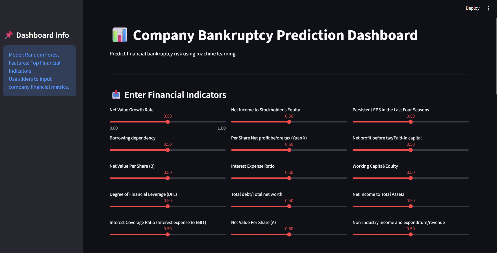
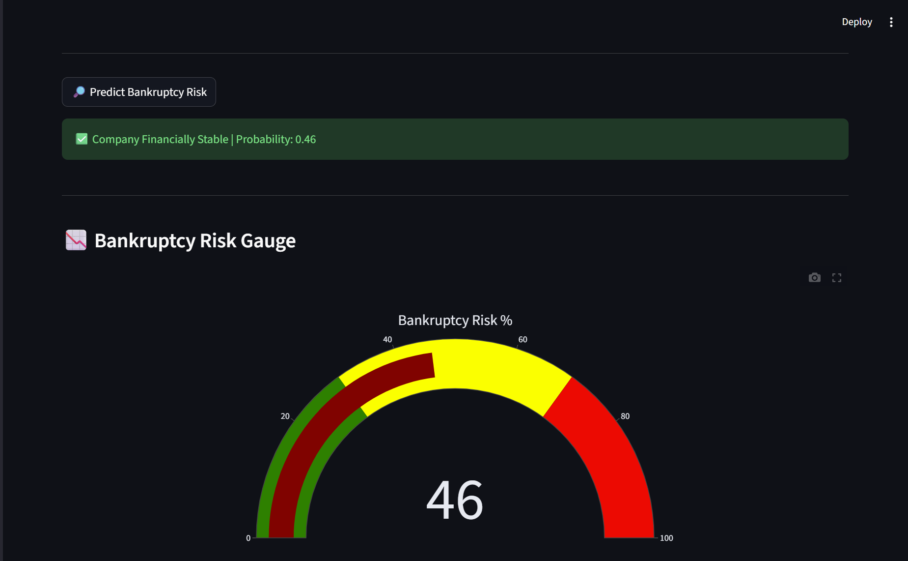
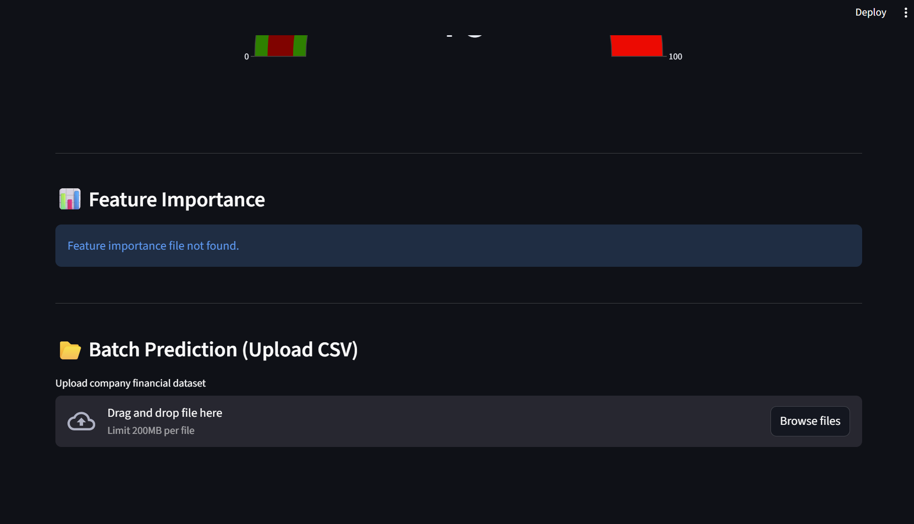

# 📊 Bankruptcy Predictor

A Machine Learning Dashboard that predicts **company bankruptcy risk** using financial indicators.

The system analyzes key financial ratios and estimates the **probability that a company may go bankrupt** using a trained **Random Forest Machine Learning model**.

The project integrates:

- Machine Learning
- Data Analysis
- Interactive Dashboard
- Financial Risk Prediction

---
# 📚 Table of Contents

- Project Overview
- Machine Learning Workflow
- Dataset Details
- Dataset Statistics
- Important Financial Indicators
- System Architecture
- Tech Stack
- Dashboard Features
- UI Screenshots
- Project Structure
- Running the Project
- Future Improvements
- Author

---

# 📌 Project Overview

Financial bankruptcy can cause severe losses for investors, creditors, and businesses.  
Early prediction of bankruptcy risk helps organizations take preventive financial actions.

This project builds a **machine learning model trained on financial indicators** to classify whether a company is likely to go bankrupt.

The system provides an **interactive Streamlit dashboard** where users can input financial indicators and obtain instant predictions.

---


# 🧠 Machine Learning Workflow

The project follows a structured **machine learning pipeline**.

### 1️⃣ Data Loading
- Import dataset
- Inspect features and target variable

### 2️⃣ Data Cleaning
- Remove duplicates
- Check missing values
- Clean column names

### 3️⃣ Exploratory Data Analysis (EDA)

Performed analysis including:

- Target class distribution
- Feature correlation analysis
- Financial ratio interpretation
- Outlier detection

### 4️⃣ Feature Selection

Using **Random Forest Feature Importance**, the most influential financial indicators were selected.

This reduces noise and improves model performance.

### 5️⃣ Model Training

Algorithm used:
Random Forest Classifier

Steps:

- Train-Test Split
- Model fitting
- Prediction probability estimation

### 6️⃣ Model Evaluation

Metrics used:

- Accuracy
- Precision
- Recall
- F1 Score
- Confusion Matrix

### 7️⃣ Deployment

The trained model is deployed using an **interactive Streamlit web dashboard**.

---

# 📊 Dataset Details

Dataset used:

**Taiwan Bankruptcy Prediction Dataset**

Source:

UCI Machine Learning Repository

The dataset contains **financial ratios derived from company financial statements**.

### Dataset Properties

| Property | Value |
|--------|------|
Total Samples | 6819 |
Total Features | 95 |
Target Variable | Bankrupt? |
Problem Type | Binary Classification |

---

# 📈 Dataset Statistics

### Class Distribution

| Class | Count | Percentage |
|------|------|------|
Non-Bankrupt | 6599 | 96.77% |
Bankrupt | 220 | 3.23% |

This dataset is **highly imbalanced**, which is common in bankruptcy prediction problems.

---

# 📊 Important Financial Indicators

Some of the most influential indicators include:

- Return on Assets (ROA)
- Net Income to Total Assets
- Debt Ratio
- Liability to Equity
- Borrowing Dependency
- Retained Earnings to Assets
- Net Profit Growth
- Working Capital to Equity

These indicators represent:

- Profitability
- Liquidity
- Financial leverage
- Debt dependency

---

# 🏗 System Architecture
            +----------------------+
            | Financial Dataset    |
            +----------+-----------+
                       |
                       v
            +----------------------+
            | Data Cleaning        |
            +----------------------+
                       |
                       v
            +----------------------+
            | Exploratory Data     |
            | Analysis (EDA)       |
            +----------------------+
                       |
                       v
            +----------------------+
            | Feature Selection    |
            | Random Forest        |
            +----------------------+
                       |
                       v
            +----------------------+
            | Model Training       |
            | Random Forest Model  |
            +----------------------+
                       |
                       v
            +----------------------+
            | Model Deployment     |
            | Streamlit Dashboard  |
            +----------------------+
                       |
                       v
            +----------------------+
            | Bankruptcy Prediction|
            +----------------------+
            
---

# ⚙ Tech Stack

### Programming Language

- Python

### Data Processing

- Pandas
- NumPy

### Visualization

- Matplotlib
- Seaborn
- Plotly

### Machine Learning

- Scikit-learn
- Random Forest Classifier

### Web Application

- Streamlit

### Model Storage

- Joblib

### Version Control

- Git
- GitHub

---

# 🖥 Dashboard Features

The interactive dashboard provides:

### 📊 Bankruptcy Prediction

Users can input financial indicators and receive a bankruptcy prediction.

### 📉 Risk Gauge

A visual gauge meter shows bankruptcy probability.

### 📈 Feature Importance

Displays which financial indicators most influence bankruptcy prediction.

### 📂 Batch Prediction

Upload a CSV file containing multiple companies and obtain predictions.

### 📥 Download Results

Prediction results can be downloaded as a CSV file.

---

# 📸 Dashboard UI Screenshots

Below are screenshots of the application interface.

---

## 🖥 Dashboard Overview



The main dashboard allows users to input financial indicators through interactive sliders.

---

## 📉 Bankruptcy Risk Gauge



The application visualizes the bankruptcy probability using a **speedometer-style risk gauge**.

Risk levels:

- Green → Low Risk
- Yellow → Medium Risk
- Red → High Risk

---

## 📂 Batch Prediction Feature



Users can upload a **CSV dataset containing company financial indicators** to obtain predictions for multiple companies.

---

# 📁 Project Structure
```
Bankruptcy_Predictor
│
├── app.py
├── train_model.py
├── select_features.py
│
├── bankruptcy_model.pkl
├── top_features.csv
├── feature_importance.csv
│
├── data
│   └── cleaned_data.csv
│
├── screenshots
│   ├── dashboard_overview.png
│   ├── risk_gauge.png
│   └── batch_prediction.png
│
├── requirements.txt
├── README.md
└── .gitignore
```

---

# 🚀 Running the Project

### 1️⃣ Clone Repository
git clone https://github.com/YOUR_USERNAME/Bankruptcy_Predictor.git

### 2️⃣ Navigate to Folder


cd Bankruptcy_Predictor


### 3️⃣ Install Dependencies


pip install -r requirements.txt


### 4️⃣ Run the Dashboard


streamlit run app.py

The application will open in your browser.

---

# 🔮 Future Improvements

Possible enhancements:

- SHAP explainability for model interpretation
- Deep learning models for financial prediction
- Company financial trend analysis
- Risk clustering
- Integration with real financial datasets
- Multi-company comparison dashboard

---

# 👨‍💻 Author

**Kunal Pramanik**

Machine Learning & Data Science Enthusiast

